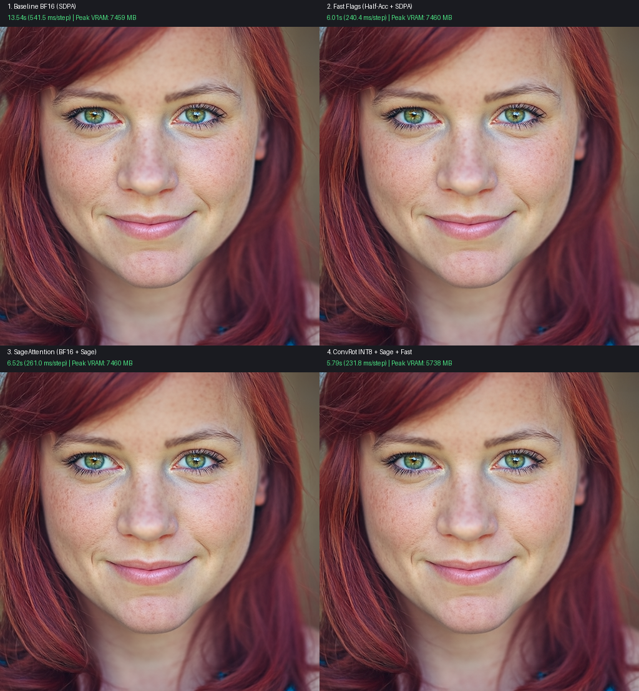

<div align="center">

# Pyramid-JiT: Low-Res Drafts, High-Res Images

**[Manu Chopra](https://www.linkedin.com/in/manu-chopra-50360b170/) · [Sahil Chopra](https://thesahilchopra.com/)**

*Linum*

[](https://www.linum.ai/field-notes/pyramid-jit)
[](https://huggingface.co/Linum-AI/pyramid-jit)
[](LICENSE)

</div>

> [!WARNING]
> **Research checkpoint: this is an experimental research artifact, not a production model.**
> P-JiT was trained for 138M samples and has not been post-trained. It is a research preview
> on the road to our v3 model. We're releasing it to share our preliminary findings with the
> broader field and to encourage others to explore efficient training methods like ours.
> Expect rough edges.


*P-JiT reaches Linum v2's FD-DINOv2 on 11.3x fewer training samples and trains in 4.3x fewer
GPU-hours, at 4x the pixels. Both figures are from the
[blog post](https://www.linum.ai/field-notes/pyramid-jit), which has the full write-up.*

P-JiT (Pyramid-JiT) is a 2.2B-parameter **pixel-space** text-to-image diffusion transformer
from Linum. It generates images directly in RGB (no VAE) with a single decoder-only DiT that
reads the noisy image as 32x32-pixel patches (256 tokens at 512x512) together with the caption
and predicts the clean image directly (x-prediction).

What makes it a pyramid is how it was trained: lightweight readout heads predicted the target
image at increasing resolutions along the trunk, 128x128 after block 10 and 256x256 after
block 16, before the final head's 512x512. Those readouts only shape training. Sampling uses
the final head alone, so they are not part of the released weights; see
[`loss.py`](loss.py) for the full objective.

## Samples


*512x512 samples from the [blog post](https://www.linum.ai/field-notes/pyramid-jit)'s appendix.*

## Getting started

```bash
sudo apt-get install -y build-essential python3-dev   # Triton compiles small CUDA shims at first use
git clone https://github.com/Linum-AI/pyramid-jit && cd pyramid-jit
python3 -m venv .venv && source .venv/bin/activate
pip install -e .
```

Generate the top-left sample above:

```bash
PROMPT="A close-up portrait of a young white woman with vibrant, fiery red hair cascading over \
her shoulders in soft waves, framed from the shoulders up and centered against a softly blurred \
warm-toned background. Her fair, lightly freckled complexion sets off piercing green eyes and a \
subtle, closed-lipped smile. Soft natural light enters from the left of the frame, highlighting \
the texture of her hair and the curve of her cheek while leaving the right side in gentle shadow. \
A shallow depth of field renders the background into smooth, neutral bokeh. Lights dangle out of \
focus on the left side of the frame."
python generate.py --weights Linum-AI/pyramid-jit --qwen_model_path Qwen/Qwen3.5-4B \
    --prompt "$PROMPT" --seeds 42 --out_dir outputs
```

This needs a CUDA GPU with ~24 GB of memory (9 GB of fp32 weights plus the 8 GB Qwen3.5-4B
text encoder); the weights and the text encoder download from the Hugging Face Hub. The model
was trained on dense captions of around 80 words, so rewrite short prompts into a detailed
description of the subject, composition, lighting and background first.

## Architecture

| | |
|---|---|
| Input patch | 32x32 px, linear 3,072 -> 1,024 -> 2,944 (256 tokens at 512²) |
| Trunk | 22 single-stream DiT blocks · width 2,944 · 23 heads x 128 · SwiGLU 7,936 |
| Refiners | 2 image + 2 text blocks before the trunk, timestep-modulated |
| Block | Sandwich RMSNorm, low-rank AdaLN (scale-in, tanh gate-out), q/k RMSNorm, sigmoid attention gate |
| Text | Qwen3.5-4B (frozen), hidden layers 7, 15, 27 concatenated -> MLP · 256 tokens |
| Parameters | 2.18B |

The two training-time readout heads and the PixelREPA adapter play no part in sampling and are
not included; [`loss.py`](loss.py) has reference implementations of them and of every other
term in the training objective.

## Sampling

50 Euler steps from noise (scale 2) to the image, with
[adaptive projected guidance](https://arxiv.org/abs/2410.02416) at scale 15 against the
negative prompt `"watermark, signature, logo, copyright, url"`, under bf16 autocast.

The initial noise is drawn exactly as `torch.randn` draws it on an H100 SXM, the GPU the model
was trained on ([`pyramid_jit/noise.py`](pyramid_jit/noise.py)), so a seed gives the same
image on any NVIDIA GPU rather than one that depends on the GPU model. Pass `--native_noise`
to use the local GPU's own draw. Attention runs on FlashAttention-3 when
`flash_attn_interface` is installed and on PyTorch SDPA otherwise.

## Hardware Optimizations & Benchmarks (Blackwell / Ada / ComfyUI-Kitchen Stack)

This fork ports low-level acceleration kernels from the `comfy-kitchen` and modern generative inference stack directly into standalone Pyramid-JiT, enabling full execution on consumer 16 GB GPUs (tested on NVIDIA GeForce RTX 5060 Ti SM120):

1. **ConvRot INT8 Linear Quantization**: Orthogonal regular Hadamard transformation ($H_{64}$) applied to weights and online activation inputs via `torch.ops.comfy_kitchen.int8_linear`, eliminating activation outlier bottlenecks and reducing static VRAM by **1.72 GB (-23%)**.
2. **Fast Reduced-Precision Accumulation (`--fast`)**: Enables half-precision accumulation (`allow_fp16_accumulation`, `allow_bf16_reduced_precision_reduction`, and `allow_fp16_bf16_reduction_math_sdp`) for >2x faster tensor core throughput.
3. **SageAttention Backend (`--attention_backend sage`)**: Full-attention acceleration via `sageattention.sageattn_varlen` with prompt masking and padding isolation.
4. **Qwen3.5-4B 4-bit NF4 Text Encoder**: Quantized text encoder requiring only ~3.2 GB VRAM instead of ~9 GB.



### Benchmark Comparison (RTX 5060 Ti, Seed 42, 25 Steps @ 512x512)

| Configuration | Total Time | Latency / Step | Throughput | Peak VRAM | Speedup |
| :--- | :--- | :--- | :--- | :--- | :--- |
| **1. Baseline BF16 (SDPA)** | 13.54s | 541.5 ms/step | 1.85 it/s | 7,459 MB | 1.00x |
| **2. Fast Flags (Half-Acc + SDPA)** | 6.01s | 240.4 ms/step | 4.16 it/s | 7,460 MB | **2.25x** |
| **3. SageAttention (BF16 + Sage)** | 6.52s | 261.0 ms/step | 3.83 it/s | 7,460 MB | **2.08x** |
| **4. ConvRot INT8 + Sage + Fast** | **5.79s** | **231.8 ms/step** | **4.31 it/s** | **5,738 MB** | **2.34x** |

### Running Optimized CLI & Web UI

Launch the optimized Gradio Web UI:
```bash
python app.py --quantization 4bit --fast --convrot --attention_backend sage --host 0.0.0.0 --port 7860
```

Run optimized command-line generation:
```bash
python generate.py \
    --weights /path/to/pyramid-jit \
    --qwen_model_path /path/to/Qwen3.5-4B \
    --prompt "$PROMPT" \
    --seeds 42 \
    --fast \
    --convrot \
    --attention_backend sage
```

## Python API

```python
from pyramid_jit import PyramidJiT, QwenTextEncoder, SamplerConfig, generate

model = PyramidJiT.from_pretrained("Linum-AI/pyramid-jit")   # or a local weights directory
text_encoder = QwenTextEncoder("Qwen/Qwen3.5-4B")
images = generate(model=model, text_encoder=text_encoder, prompt=prompt, seeds=[42],
                  sampler=SamplerConfig())   # one (3, 1, H, W) uint8 tensor per seed
```

## Citation

```bibtex
@online{chopra2026pyramidjit,
  title = {Pyramid-JiT: Low-Res Drafts, High-Res Images},
  author = {Chopra, Manu and Chopra, Sahil},
  year = {2026},
  url = {https://www.linum.ai/field-notes/pyramid-jit}
}
```

## Authorship

This repository was written by Claude (Anthropic's Opus 5.5 model, running in Claude Code).
Linum asked it to extract the model, inference code and training loss from Linum's internal
experiment repository and verify the result: the extracted model matches the internal one
tensor-for-tensor. The model, the training, and the review of this repository are Linum's.

## About Linum

Linum is a team of two brothers building a tiny-yet-powerful AI research lab. We train our
own generative media models from scratch.

**Subscribe to [Field Notes](https://buttondown.com/linum-ai)**: technical deep dives on
building generative video models from the ground up, plus updates on new releases from Linum.

**Contact:** hello@linum.ai

## License

Apache-2.0. Copyright 2026 Linum Inc. See [LICENSE](LICENSE).
